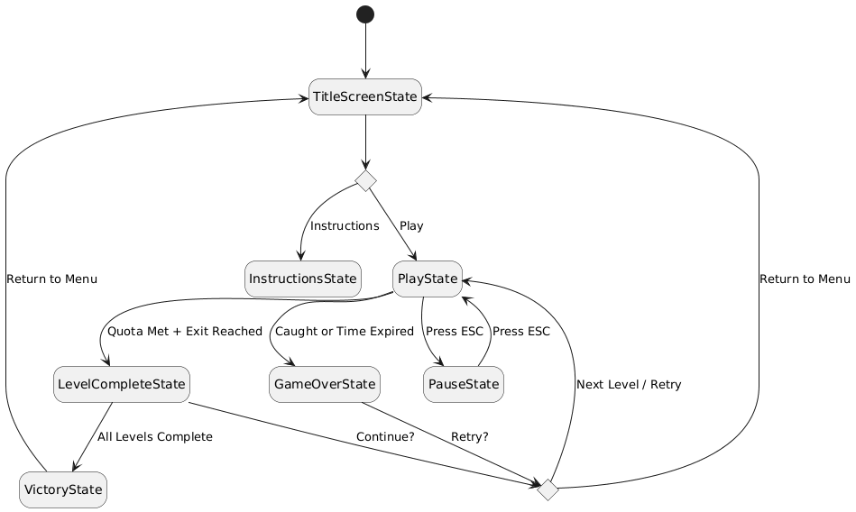
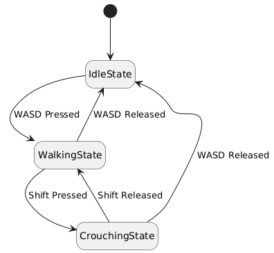
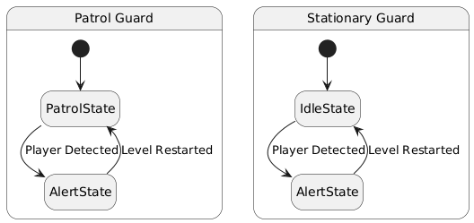
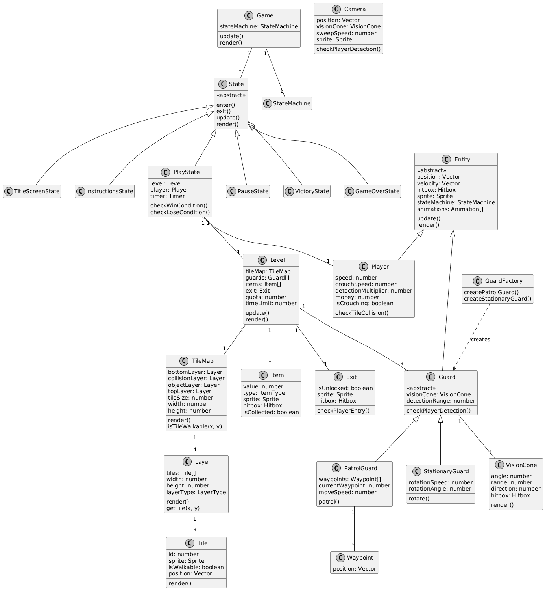
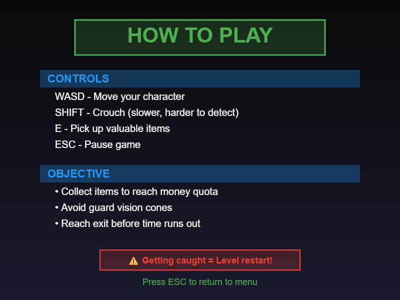
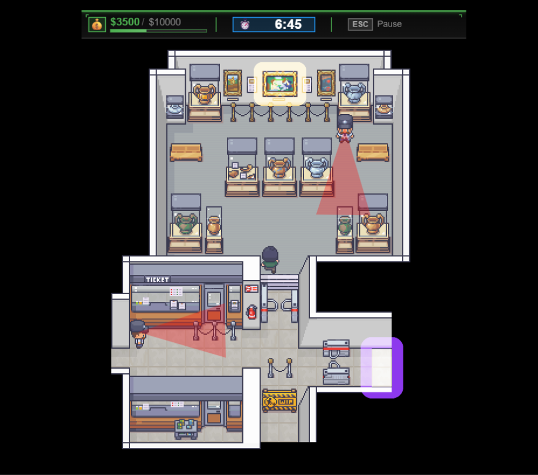
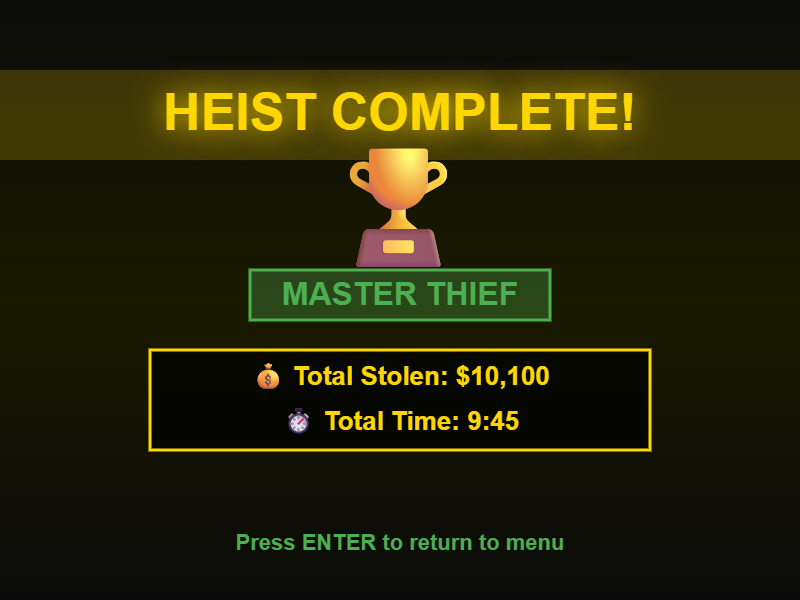

# Stealth Heist

## ✒️ Description

**Stealth Heist** is a top-down stealth/puzzle game where players take on the role of a skilled thief attempting to pull off the ultimate museum heist. The player must navigate through multiple galleries and rooms while avoiding detection from guards and security systems to steal valuable items and escape before time runs out.

### Premise

You are a skilled thief breaking into a large museum to steal valuable artifacts, paintings, dinosaur fossils, and rare souvenirs. The museum has varying levels of security - outer galleries are lightly guarded while the inner exhibition halls are heavily protected. Your goal is to collect at least $10000 worth of items and escape within 10 minutes before security locks down the building.

### Genre

Top-down stealth/puzzle game with action elements.

## 🕹️ Gameplay

The game is played from a top-down perspective where the player must navigate through each level while avoiding detection. Players use stealth mechanics to avoid guard vision cones while collecting valuable items scattered throughout the environment.

### Core Mechanics

**Movement & Stealth:**

-   Players move their character using WASD keys in four directions
-   Holding Shift enables crouching, which slows movement speed to 50% but reduces detection range to 60%
-   The player must stay outside of guard vision cones

**Collection System:**

-   The museum contains various items (paintings, artifacts, dinosaur fossils, souvenirs) with different monetary values ($200, $1000, $500, $50)
-   Players press E to pick up items when standing near them
-   A monetary quota of $10000 must be reached before the exit unlocks
-   Current money collected is displayed in the HUD with smooth tween animation

**Time Pressure:**

-   The museum heist has a 10-minute countdown timer
-   Player must collect the quota and reach the exit before time expires
-   Timer is displayed prominently in the HUD

**Detection & Consequences:**

-   If the player enters a guard's vision cone, they are instantly caught
-   Being caught results in immediate level restart with screen shake effect
-   Running out of time also results in level restart
-   No lives system - players can retry unlimited times

**Victory Conditions:**

-   Collect items worth at least $10000 (the quota)
-   Reach the exit door (which unlocks when quota is met)
-   Complete objective before the 10-minute timer runs out

### Controls

-   **WASD** - Move character (up, left, down, right)
-   **Shift** - Crouch (50% movement speed, 60% detection range)
-   **E** - Pick up items/interact
-   **ESC** - Pause game

### Enemy Types

**Patrol Guards:**

-   Move along predetermined waypoint paths
-   Have forward-facing vision cones
-   Return to their patrol route after level restart

**Stationary Guards:**

-   Stand in fixed positions
-   Rotate their vision cone back and forth
-   Cover key chokepoints and valuable items

### Level Progression

**The Museum Heist**

-   Theme: Large natural history and art museum with multiple galleries
-   Difficulty: Progressive - outer galleries lightly guarded, inner halls heavily protected
-   Layout: Multi-room museum with interconnected galleries
    -   Entrance Hall (light security - few guards)
    -   Main Gallery (moderate security)
    -   Fossil Hall (moderate security)
    -   Rare Exhibits Wing (heavy security - more guards)
-   Quota: $10000
-   Timer: 10:00 (10 minutes)
-   Features:
    -   Mix of patrol guards and stationary guards
    -   Items of varying value throughout ($50-$1000)
    -   Paintings, artifacts, dinosaur fossils, souvenirs to steal
    -   Progressive difficulty - outer rooms easier, inner halls heavily guarded
    -   Multiple paths through the museum

## 📃 Requirements

The player shall be able to:

1. View a title screen with menu options upon starting the game
2. Select "Continue" from title screen to resume saved game (if save data exists)
3. Select "New Game" from title screen to start fresh from Level 1
4. Navigate to an instructions screen to learn game controls and mechanics
5. Return to title screen from instructions screen
6. Start a new game from the title screen
7. Move their character in four directions using WASD keys
8. Crouch by holding Shift to move at 50% speed with 60% detection range
9. Pick up items by pressing E when near them
10. See the current money collected displayed in the HUD with smooth tween animation
11. See the monetary quota needed displayed in the HUD
12. See the remaining time displayed in the HUD
13. Navigate through tile-based levels with walls and obstacles using AABB collision
14. Avoid detection from patrol guards that move along waypoint paths with vision cones
15. Avoid detection from stationary guards that rotate their vision cones in place
16. Collect items with varying monetary values ($200, $1000, $500, $50)
17. See items bob/pulse to indicate they're collectible
18. See collected items animate (scale + fade) when picked up
19. Reach the monetary quota ($10000) to unlock the exit door (with unlock animation)
20. Navigate to and enter the exit door to complete the heist
21. Complete the heist before the 10-minute timer expires
22. View a victory screen showing statistics after completing the heist with slide-in animation
23. Experience screen shake effect when caught by a guard
24. Restart the level immediately upon being caught (with flash effect)
25. Restart the level immediately upon running out of time
26. Pause and unpause the game using the ESC key
27. Quit to main menu from pause screen
28. View a victory screen upon completing the heist
29. Return to the title screen after victory
30. Have the game automatically save current state (position, money, time, collected items) to local storage
31. Resume exactly where they left off after closing and reopening the game
32. See smooth fade transitions between game states

## 🤖 State Diagrams

### Game State Machine

The main game flow transitions between different states based on player actions and game events.



-   Game starts at **TitleScreenState**
-   Player can choose to view **InstructionsState** or jump to **PlayState**
-   **InstructionsState** can return to **TitleScreenState**
-   During **PlayState**, pressing ESC enters **PauseState**
-   **PauseState** can resume play or quit to **TitleScreenState**
-   Getting caught or running out of time transitions to **GameOverState**
-   Completing the heist objectives transitions to **VictoryState**
-   **GameOverState** offers option to retry
-   **VictoryState** returns to **TitleScreenState**

### Player State Machine

The player character has three distinct movement states that affect gameplay mechanics.



-   **IdleState**: Standing still, no movement input
-   **WalkingState**: Normal movement speed (100%), standard detection range (100%)
-   **CrouchingState**: Reduced movement speed (50%), reduced detection range (60%)

### Guard State Machines

Guards have different state machines based on their type.



**Patrol Guard:**

-   **PatrolState**: Moves along waypoint path
-   **AlertState**: Player detected, triggers level restart

**Stationary Guard:**

-   **IdleState**: Stands still, vision cone faces one direction
-   **RotatingState**: Rotates vision cone back and forth (sweeping)
-   **AlertState**: Player detected, triggers level restart
-   Guards can transition between idle and rotating states

## 🗺️ Class Diagram

The class diagram shows the relationships between all major classes in the game, including inheritance hierarchies and the factory pattern.



### Key Relationships:

**Inheritance:**

-   `Player` and `Guard` both inherit from `Entity` (abstract base class)
-   `PatrolGuard` and `StationaryGuard` inherit from `Guard` (abstract class)
-   All game states inherit from `State` (abstract base class)

**Factory Pattern:**

-   `GuardFactory` creates instances of `PatrolGuard` and `StationaryGuard`
-   `ItemFactory` creates instances of `Item` with different types and values

**Composition:**

-   `Game` has a `StateMachine` and manages multiple `State` objects
-   `PlayState` contains a `Level`, `Player`, and `Timer`
-   `Level` contains a `TileMap`, multiple `Guard` objects, multiple `Item` objects, and an `Exit`
-   `TileMap` contains 4 `Layer` objects (bottom, collision, object, top)
-   `Layer` contains many `Tile` objects
-   `Guard` has a `VisionCone` for detection
-   `PatrolGuard` has multiple `Waypoint` objects defining its patrol route

**Key Classes:**

-   **Entity**: Base class for all movable game objects (player, guards)
-   **Guard**: Abstract base class for enemy types with detection logic
-   **PatrolGuard**: Guard that moves along waypoints
-   **StationaryGuard**: Guard that stays in place and rotates
-   **VisionCone**: Handles detection area rendering and collision
-   **GuardFactory**: Creates different types of guards
-   **ItemFactory**: Creates collectible items with various values
-   **TileMap**: Manages the 4-layer tilemap system
-   **Layer**: Contains tiles for one layer (bottom, collision, object, or top)
-   **Tile**: Individual tile with sprite and walkability information

## 🧵 Wireframes

### Title Screen


-   **Continue** - Resume from saved game state (only shown if save data exists)
-   **New Game** - Start fresh from Level 1
-   **Instructions** - Shows control scheme and gameplay rules
-   **Quit** - Close the game (browser tab)
-   Clean, thematic background with game title prominently displayed
-   Menu options with hover animations (scale tween)

### Instructions Screen



-   Control scheme displayed (WASD, Shift, E, ESC)
-   Brief explanation of game objectives
-   Guard detection mechanics explained
-   "Press ESC to return to menu" prompt

### Gameplay Screen



The main game interface showing active gameplay:

**HUD Elements (Top Bar):**

-   Left: Money collected / Quota (💰 $3500 / $10000)
-   Center: Timer countdown (⏱️ 6:45)
-   Right: Pause instruction (ESC - Pause)

**Main Play Area:**

-   Top-down view of the current level
-   Player character in black and green
-   Guards in blue with translucent red vision cones shown
-   Collectible items in gold
-   Exit door in purple (locked until quota met)
-   Walls and environmental tiles

**Visual Indicators:**

-   Vision cones rendered with transparency
-   Clear distinction between walkable and non-walkable tiles
-   Item values displayed when near them

### Victory Screen



-   "Heist Complete!" celebratory message
-   Trophy or achievement graphic
-   Final statistics:
    -   Total money stolen
    -   Total time taken
-   "Press ENTER to return to title screen"

### Game Over Screen


-   "CAUGHT!" or "TIME'S UP!" message depending on failure type
-   Brief context (e.g., "The guards spotted you!")
-   Current progress displayed:
    -   Money collected vs quota needed
    -   Time remaining when caught
-   "Press ENTER to retry level"

## 🎨 Assets

### 🖼️ Images & Sprites

#### Player Character

-   **Purchased sprites** with animations for:
    -   Idle (standing still)
    -   Walking (4-directional)
    -   Crouching (4-directional, slower walking animation)
-   Resolution: 32x32 pixels

All from purchased assets pack: https://limezu.itch.io/moderninteriors

#### Guards

-   **Purchased sprites** with animations for:
    -   Idle/standing
    -   Walking (patrol guards)
    -   Alert state
-   Two variations: Patrol guards and Stationary guards
-   Resolution: 32x32 pixels

All from purchased assets pack: https://limezu.itch.io/moderninteriors

#### Environment & Items

-   **Tileset for levels** - Walls, floors, furniture, exhibits

    -   Museum theme: marble floors, display cases, wall panels, security stations, fossil displays, artifact pedestals

-   **Collectible items:**

    -   Paintings ($200)
    -   Artifacts ($1000)
    -   Dinosaur fossils ($500)
    -   Rare souvenirs ($50)

All from purchased assets pack: https://limezu.itch.io/moderninteriors

-   **Security equipment:**

    -   Vision cone overlays - semi-transparent colored shapes
    -   Exit doors - animated when unlocked
    -   Sources: Custom-made

-   **UI Elements:**
    -   Money icon, timer icon
    -   Menu buttons and panels
    -   HUD background
    -   Sources: Custom-made

### ✏️ Fonts

-   **Title Font**: Bold, stylized font for main title and headings

    -   Source: [dafont](https://www.dafont.com) or [Google Fonts](https://fonts.google.com)
    -   Examples: "Bebas Neue", "Righteous", "Press Start 2P"

-   **UI Font**: Clean, readable sans-serif for HUD and menus

    -   Source: [Google Fonts](https://fonts.google.com)
    -   Examples: "Roboto", "Open Sans", "Inter"

-   **Body Text Font**: Simple font for instructions and dialogue
    -   Source: [Google Fonts](https://fonts.google.com)
    -   Example: "Lato", "Source Sans Pro"

### 🔊 Sounds & Music

#### Sound Effects

All sounds will be sourced from [freesound.org](https://freesound.org) and [OpenGameArt](https://opengameart.org):

-   **Movement:**
    -   Footsteps (normal walking)
    -   Quiet footsteps (crouching)
-   **Interactions:**
    -   Item pickup (cash register "cha-ching")
    -   Door unlock sound
    -   Exit door opening
-   **Detection:**
    -   Alert sound (siren/alarm when caught)
    -   Detection warning (subtle audio cue when near detection)
-   **UI:**
    -   Menu selection
    -   Button click
    -   Menu navigation
-   **Victory/Defeat:**
    -   Level complete jingle
    -   Victory fanfare (all levels complete)
    -   Caught sound (game over)
    -   Time's up alarm

#### Background Music

-   **Title Screen**: Mysterious, jazzy heist theme
-   **Museum (Light Security)**: Quiet, tense stealth music
-   **Museum (Heavy Security)**: Intense, suspenseful orchestral track
-   **Victory**: Upbeat celebration theme
-   **Game Over**: Dramatic failure sound

Sources: [freesound.org](https://freesound.org), [OpenGameArt](https://opengameart.org), [incompetech.com](https://incompetech.com)

_All assets will be properly credited in the main.js file with creator names and source links._

## 📚 Technical Details

### Libraries & Tools

-   **Game Engine:** Custom JavaScript/Canvas engine
-   **Library Classes:**
    -   `Animation.js` - For sprite animations (player walk cycles, guard patrols)
    -   `Timer.js` - For tweening effects, time-based mechanics, and smooth transitions
    -   `Hitbox.js` - For collision detection and vision cone areas
    -   `StateMachine.js` - For managing game and entity states

### Tweening & Juice

The game uses the `Timer.js` library extensively to create smooth, polished visual effects:

**UI Tweens:**

-   **Money Counter**: When collecting items, the money display tweens from current value to new value over 0.3 seconds instead of jumping instantly
-   **State Transitions**: Fade in/out effects (alpha tween from 0 to 1) when transitioning between game states
-   **Menu Selections**: Menu options scale up slightly (1.0 to 1.1) when hovered over

**Gameplay Tweens:**

-   **Item Animations**: Collectible items bob up and down continuously (y-position tween) to draw player attention
-   **Item Collection**: When picked up, items scale up and fade out simultaneously before disappearing
-   **Screen Shake**: When caught by a guard, the camera shakes (rapid x/y position tweens) for 0.5 seconds before restarting level
-   **Vision Cone Pulse**: Guard vision cones subtly pulse in transparency (alpha tween) to indicate active detection
-   **Exit Door Unlock**: When quota is met, exit door glows (color tween) and slightly scales up to indicate it's now accessible
-   **Player Damage Flash**: If caught, player sprite flashes red (color tween) before level restart

**Level Transitions:**

-   **Level Start**: Camera zooms in slightly (scale tween) as level begins
-   **Level Complete**: Victory panel slides in from top (y-position tween) rather than appearing instantly

All tweens use easing functions (ease-in, ease-out, ease-in-out) for natural, polished movement rather than linear interpolation.

### Algorithms & Systems

**Vision Cone Detection:**

-   Area-based detection using geometric calculations to determine if player is within guard field of view
-   Vision cones are rendered as semi-transparent triangular shapes
-   Detection range affected by player's crouch state (60% range when crouching)

**Pathfinding:**

-   Simple waypoint-based patrolling for guards
-   Patrol guards move between predefined waypoints in sequence
-   Guards follow their paths continuously, looping back to start

**Map & Movement System:**

-   **Tilemap Structure:**
    -   Uses a layered tilemap system with 4 layers:
        -   **Bottom Layer**: Floor tiles, rugs, ground decorations (rendered first)
        -   **Collision Layer**: Invisible layer defining walkable/non-walkable areas (walls, obstacles)
        -   **Object Layer**: Items, furniture, display cases - rendered at specific depth to create layering illusion
        -   **Top Layer**: Rendered above player and objects (door arches, overhead furniture, ceiling decorations)
    -   Tiles stored in 1D arrays for efficient memory access
    -   Tile size: 32x32 pixels
    -   Maps can be designed in Tiled map editor and exported as JSON
-   **Layering & Depth:**
    -   **Bottom Layer** renders first (underneath everything)
    -   **Player and Guards** render based on Y-position for depth sorting
    -   **Collectible Items** render with the Object Layer (creates illusion of being on tables, behind glass, on pedestals)
    -   **Top Layer** renders last (over everything)
    -   Example: Museum painting on wall appears "behind" player when player walks in front, but "in front of" floor
-   **Movement System:**
    -   Free movement (not grid-locked) - player can move to any pixel position
    -   Continuous x/y position updated based on velocity and delta time
    -   Movement speed: 100 pixels/second (normal walking), 50 pixels/second (crouching)
    -   Player position converted to tile coordinates for collision checking: `tileX = floor(playerX / TILE_SIZE)`
    -   Smooth, responsive controls without tile-snapping

**Collision Detection:**

-   **AABB (Axis-Aligned Bounding Box)**: Used for player vs walls, items, exit door
-   **Tilemap Collision**: Player's continuous position checked against collision layer
    -   Before moving, calculate next position
    -   Convert position to tile coordinates
    -   Check if destination tile is walkable
    -   Only update position if no collision detected
-   **Vision Cone Detection**: Player vs guard detection zones using hitbox overlap
-   **Hitbox Class**: All entities and objects have hitboxes for collision detection

**Local Storage - Full State Persistence:**

-   Save complete game state including:
    -   Current room/area within the museum
    -   Player position (x, y coordinates)
    -   Money collected
    -   Time remaining on timer
    -   Which items have been collected (array of item IDs)
    -   Player state (walking, crouching, idle)
-   Players can close the game mid-heist and resume exactly where they left off
-   "Continue" option on title screen if saved state exists
-   "New Game" option to start fresh from the museum entrance

## 💾 Persistence System

The game implements a comprehensive save system using browser Local Storage that allows players to resume exactly where they left off, even mid-level.

### What Gets Saved

**Game Progress:**

-   Current room/area player is in
-   Total heist completion progress

**Current Game State:**

-   Player position (x, y coordinates)
-   Player current state (idle, walking, crouching)
-   Money collected in current session
-   Time remaining on countdown timer
-   Array of collected item IDs (so they don't respawn)
-   Exit door unlock status (boolean)

**Example Save Data Structure:**

```javascript
{
    currentRoom: "main-gallery",
    levelState: {
        playerX: 150,
        playerY: 200,
        playerState: "crouching",
        moneyCollected: 450,
        timeRemaining: 485,
        collectedItemIds: [1, 3, 5, 7, 12, 15],
    }
}
```

### Save Triggers

The game automatically saves:

-   After every room transition
-   When pausing the game
-   When collecting an item
-   Every 10 seconds during active gameplay (auto-save)
-   When quitting to main menu

### Load System

**On Game Start:**

-   Check if save data exists in localStorage
-   If exists: Show "Continue" and "New Game" options on title screen
-   If no save data: Only show "New Game" option

**Continue Option:**

-   Loads complete game state
-   Resumes player at exact position
-   Restores money, timer, and collected items
-   Already-collected items don't respawn
-   Exit remains unlocked if quota was already met

**New Game Option:**

-   Clears any existing save data
-   Starts fresh from the museum entrance
-   Resets all progress

### Benefits

This full state persistence provides:

-   **Player Convenience**: Can close game anytime and resume later
-   **No Progress Loss**: Even mid-level progress is preserved
-   **Flexible Play Sessions**: Supports short gaming sessions
-   **Error Recovery**: Game state preserved even if browser crashes

This implementation goes beyond simple high score saving and provides a complete save/load system equivalent to modern games.

### Enums

```javascript
// Player states
PlayerState = {
    Idle: "idle",
    Walking: "walking",
    Crouching: "crouching",
};

// Guard states
GuardState = {
    Patrol: "patrol",
    Idle: "idle",
    Rotating: "rotating",
    Alert: "alert",
};

// Game states
GameState = {
    TitleScreen: "title",
    Instructions: "instructions",
    Play: "play",
    Pause: "pause",
    Victory: "victory",
    GameOver: "gameOver",
};

// Movement directions
Direction = {
    Up: "up",
    Down: "down",
    Left: "left",
    Right: "right",
};

// Item types with different values
ItemType = {
    Painting: "painting",
    Artifact: "artifact",
    Fossil: "fossil",
    Souvenir: "souvenir",
};

// Item values (monetary worth)
ItemValue = {
    [ItemType.Painting]: 200,
    [ItemType.Artifact]: 1000,
    [ItemType.Fossil]: 500,
    [ItemType.Souvenir]: 50,
};

// Guard types for factory
GuardType = {
    Patrol: "patrol",
    Stationary: "stationary",
};

// Layer types for tilemap
LayerType = {
    Bottom: "bottom",
    Collision: "collision",
    Object: "object",
    Top: "top",
};
```

No magic numbers or strings will be used in the codebase - all constants are defined as enums.

## 📝 Implementation Plan

### Phase 1: Core Mechanics

-   **Tilemap System:**
    -   Implement Layer class (bottom, collision, object, top)
    -   Implement Tile class with sprite rendering
    -   Implement TileMap class managing all 4 layers
    -   Basic tilemap rendering (bottom, object, and top layers)
    -   Collision layer setup (invisible, used for walkability checks)
    -   Proper render order: bottom → collision (debug) → player/guards → object layer → top layer
-   **Player Movement:**
    -   Basic player movement with WASD (free movement, not grid-locked)
    -   Continuous position updates based on velocity
    -   Player animations (idle, walk in 4 directions)
    -   Tilemap collision detection (convert player position to tile coordinates, check collision layer)
    -   Simple state machine (TitleScreen, PlayState)

### Phase 2: Stealth Systems

-   Vision cone implementation and rendering
-   Guard base class with patrol and stationary variants
-   Guard factory for creating different guard types
-   Player detection logic
-   Player crouch mechanic with detection modifier

### Phase 3: Game States & UI

-   All game states (Instructions, Pause, LevelComplete, Victory, GameOver)
-   HUD implementation (money, quota, timer)
-   Item collection system with ItemFactory
-   Exit door with unlock condition

### Phase 4: Level Design & Content

-   Large museum level with multiple interconnected rooms
-   Tileset integration for museum theme
-   Guard placement and waypoint paths throughout museum
-   Item placement with varying values in different galleries
-   Progressive difficulty (outer galleries easier, inner vault harder)
-   10-minute timer system

### Phase 5: Persistence System

-   Local storage implementation
-   Save complete game state (position, money, time, collected items, current room)
-   Load game state on startup
-   Continue/New Game options on title screen

### Phase 6: Polish & Juice

-   **Tween Implementation:**
    -   Money counter smooth increment
    -   Item bob/pulse animations
    -   Item collection scale+fade effect
    -   Screen shake on capture
    -   Vision cone pulse effect
    -   Exit door unlock animation
    -   State transition fades
    -   Menu hover animations
-   Sound effects for all actions
-   Background music for different museum areas
-   Particle effects (optional stretch goal)

### Phase 7: Testing & Balancing

-   Playtest the museum level
-   Adjust guard patrol speeds and placements
-   Balance item values and quota
-   Fine-tune 10-minute timer duration
-   Bug fixes and edge case handling
-   Ensure progressive difficulty feels right