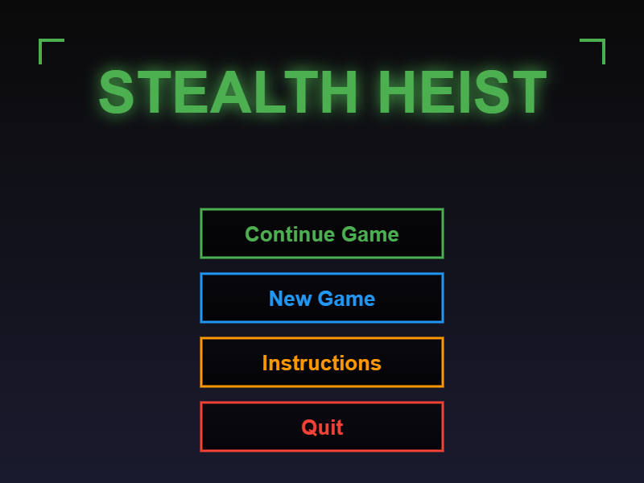
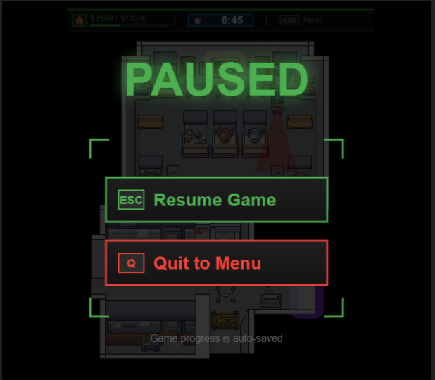
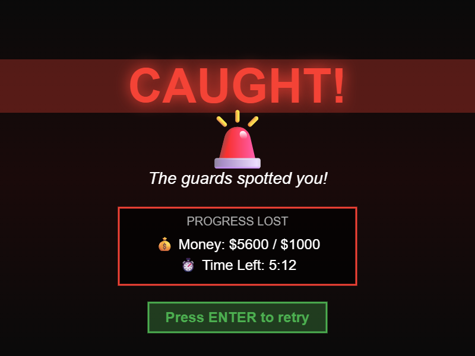

# Stealth Heist

> **AI Usage Disclaimer**: Claude was used to help structure this proposal document, generate wireframe mockup code, and format the README. All game design decisions, mechanics, and implementation strategies are my own work.

## ✒️ Description

**Stealth Heist** is a top-down stealth game where you play as a thief breaking into a museum. Navigate through multiple galleries while avoiding guard vision cones and security cameras to steal valuable items worth $10,000 and escape within 10 minutes.

## 🕹️ Gameplay

Players use **WASD** to move freely (not grid-locked) and **Shift** to crouch (slower movement, reduced detection). Press **E** to pick up items (paintings, artifacts, fossils, souvenirs) worth $50-$1000. Guards patrol along waypoints or stand still rotating their vision cones. Getting caught by a guard or running out of time restarts the level. The exit unlocks once you've collected $10,000, then you must reach it before time expires.

The museum has 4 interconnected areas with progressive difficulty: Entrance Hall (light security) → Main Gallery → Fossil Hall → Rare Exhibits Wing (heavy security). Multiple paths allow different strategies.

## 📃 Requirements

The player shall be able to:

1. Move in four directions (WASD) with free movement (not grid-locked)
2. Crouch (Shift) to move slower (50% speed) but reduce detection range (60%)
3. Pick up items (E key) with varying values ($50, $200, $500, $1000)
4. Navigate tile-based levels with AABB collision detection
5. Avoid patrol guards with vision cones moving along waypoint paths
6. Avoid stationary guards that rotate their vision cones or face one direction
7. See HUD displaying: money collected / quota, timer countdown, pause hint
8. Collect items until reaching $10,000 quota to unlock exit
9. Reach the exit before 10-minute timer expires
10. Get caught and restart level instantly (screen shake effect)
11. Pause/unpause game (ESC key)
12. Save game state to local storage (position, money, time, collected items)
13. Resume from exact position after reopening game (Continue option)
14. See smooth tweens: money counter, item bob/pulse, collection effects, screen shake, vision cone pulse, exit unlock, state transitions
15. View victory screen after completing heist
16. Return to title screen and start new game

## 🤖 State Diagrams

### Game States

TitleScreen → Instructions (optional) → Play → (Victory or GameOver) → back to TitleScreen. Pause state accessible during Play.

### Player States

Idle ↔ Walking ↔ Crouching (based on input)

### Guard States

**Patrol Guard**: Patrol → Alert (player detected)  
**Stationary Guard**: Idle/Rotating ↔ Alert (player detected)

## 🗺️ Class Diagram

**Key Relationships**:

-   `Entity` (abstract) → `Player`, `Guard` (abstract)
-   `Guard` → `PatrolGuard`, `StationaryGuard`
-   `GuardFactory` creates guard types (factory pattern)
-   `Level` has `TileMap` (4 layers: bottom, collision, object, top), guards, items, exit
-   `Player` and `Guard` have state machines
-   `Guard` has `VisionCone` with hitbox for detection

## 🧵 Wireframes

### Screens

  
  
  
  
  

Gameplay shows top-down museum view with HUD bar (money/quota, timer, pause hint), player sprite, guards with vision cones, and collectible items.

## 🎨 Assets

**Sprites**: All from purchased [Modern Interiors pack](https://limezu.itch.io/moderninteriors) - player (32x32, idle/walk/crouch animations), guards (32x32, idle/walk/alert), museum tileset, collectible items.

**Fonts**: Title font (bold, e.g., "Bebas Neue"), UI font (clean sans-serif, e.g., "Roboto") from [Google Fonts](https://fonts.google.com).

**Sounds**: From [freesound.org](https://freesound.org) and [OpenGameArt](https://opengameart.org) - footsteps, item pickup, alert siren, UI clicks, victory/defeat jingles, background music (title, gameplay, victory).

## 📚 Technical Details

**Engine**: Custom JavaScript/Canvas using course library classes (`Animation.js`, `Timer.js`, `Hitbox.js`, `StateMachine.js`).

**Tilemap**: 4 layers (bottom floor, collision, object, top) with 32x32 tiles. Free movement with collision detection by converting position to tile coordinates.

**Vision Cone Detection**: Geometric area-based detection. Player caught if hitbox overlaps guard vision cone (affected by crouch state).

**Persistence**: Full state saving to localStorage - saves position, money, time, collected item IDs, current room. Auto-saves every 10 seconds.

**Tweens**: Money counter, item bob/pulse, collection scale+fade, screen shake, vision cone pulse, exit unlock, state transitions (using `Timer.js` with easing).

**Enums**: PlayerState, GuardState, GameState, Direction, ItemType, ItemValue, GuardType, LayerType - no magic numbers/strings.
